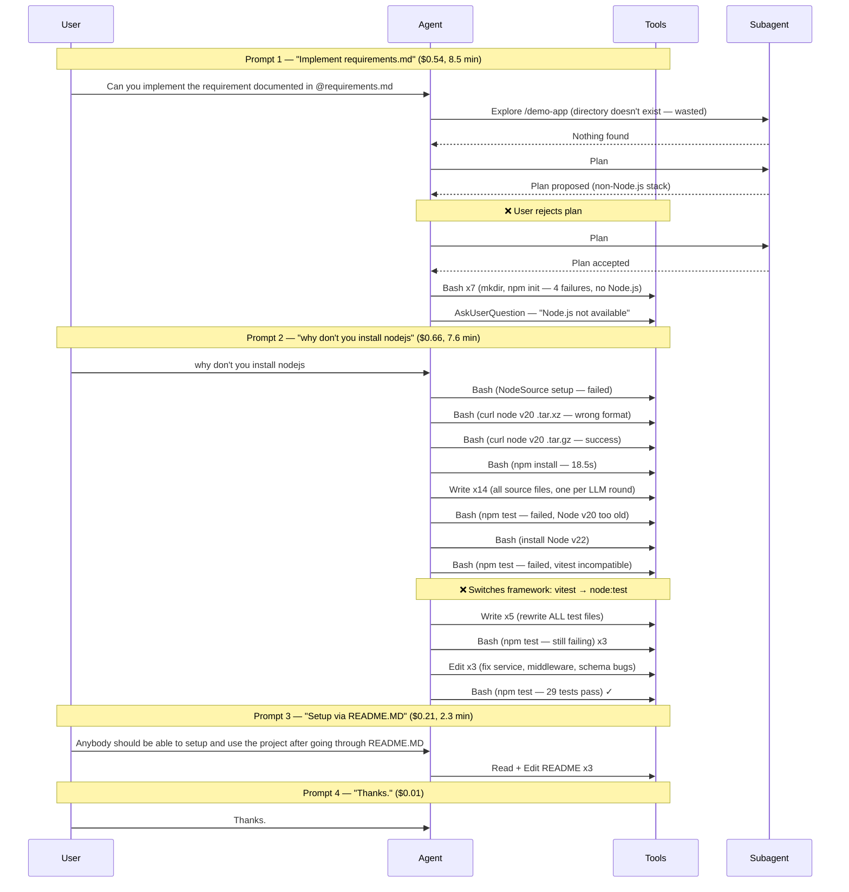

# Claude Session Profiler

A Claude Code plugin that profiles and analyzes session telemetry stored in ClickHouse (via [ClickStack](https://github.com/duyet/clickstack) or similar OTEL collectors). It produces a detailed analysis document covering token/cost breakdown, tool usage, permission friction, subagent behavior, and optimization recommendations.

## Quick Start

### 1. Set up ClickHouse with an OTEL collector

You need a ClickHouse instance receiving OpenTelemetry data. For a quick Docker-based setup using ClickStack, see [claude-code-monitoring](https://github.com/vikrantjain/claude-code-monitoring).

### 2. Enable telemetry on the Claude Code sessions you want to monitor

Add these exports to your shell profile (e.g. `~/.bashrc`, `~/.zshrc`) or a sourced env file. These must be set **before** starting the Claude Code instance you want to monitor — if set after startup, restart that session.

**Required:**

```bash
export CLAUDE_CODE_ENABLE_TELEMETRY=1
```

**Recommended (minimum for meaningful profiling):**

```bash
export OTEL_LOG_TOOL_DETAILS=1                  # Tool input JSON, result sizes
export OTEL_LOG_USER_PROMPTS=1                  # User prompt text
```

**Optional (deeper analysis):**

```bash
export OTEL_LOG_TOOL_CONTENT=1                  # Full tool I/O in trace spans
export CLAUDE_CODE_ENHANCED_TELEMETRY_BETA=1    # Span hierarchy, timing breakdown
```

**Export configuration:**

```bash
export OTEL_METRICS_EXPORTER=otlp
export OTEL_LOGS_EXPORTER=otlp
export OTEL_TRACES_EXPORTER=otlp
export OTEL_EXPORTER_OTLP_PROTOCOL=grpc
export OTEL_EXPORTER_OTLP_ENDPOINT=http://localhost:4317  # your OTEL collector gRPC endpoint
export OTEL_RESOURCE_ATTRIBUTES=host.name=$(hostname)
```

If you're using the [claude-code-monitoring](https://github.com/vikrantjain/claude-code-monitoring) setup, the default collector endpoint is `http://localhost:4317`.

See the [official telemetry docs](https://code.claude.com/docs/en/monitoring-usage) for full details.

### 3. Run at least one Claude Code session

Start Claude Code and work as usual. The session telemetry will be collected in ClickHouse. You need at least one completed session before there's anything to profile.

### 4. Install the plugin

```bash
claude plugin add https://github.com/vikrantjain/claude-session-profiler
```

Or clone and install locally:

```bash
git clone git@github.com:vikrantjain/claude-session-profiler.git
claude plugin add /path/to/claude-session-profiler
```

### 5. Configure the ClickHouse connection

On first use, the profiler will ask for your ClickHouse HTTP REST API URL including host and port (e.g. `http://localhost:8123` for a local ClickStack setup).

You can pre-configure it per project to skip this prompt:

```bash
mkdir -p .claude
cat > .claude/claude-profiler.local.md << 'EOF'
---
clickhouse_url: http://localhost:8123
---
EOF
```

### 6. Profile a session

Ask Claude to analyze your sessions:

- "Profile my last session"
- "Analyze the session from this morning"
- "What were the most expensive tool calls in my recent sessions?"

## What You Get

The profiler generates a Markdown analysis document in `session-reports/` covering:

1. **Session overview** — duration, token usage, cost, model breakdown
2. **Session flow diagram** — Mermaid sequence diagram reconstructed from telemetry (see [below](#why-the-session-flow-diagram-matters))
3. **Detailed findings** — token/cost analysis, tool usage patterns, permission friction, subagent assessment, error analysis
4. **Optimization recommendations** — actionable suggestions traced back to telemetry evidence, with confidence levels

It can also generate optimization artifacts ready to drop into your project:

- **CLAUDE.md** — project context that eliminates environment probing and tech stack guessing
- **settings.local.json** — permission allow rules that remove repetitive approval prompts
- **Refined requirements** — restructured prompt that resolves ambiguities upfront

## Why the Session Flow Diagram Matters

AI coding agents don't follow fixed workflows. The same prompt can produce completely different execution paths depending on the model, environment, project context, and even the order of tool results. Reading leaked source code or documentation tells you what the agent *could* do — the profiler shows you what it *actually did*.

The session flow diagram is reconstructed entirely from OTEL traces, not from source code or documentation. It captures the agent's real decision-making: which tools it called, when it spawned subagents, where it failed and retried, and how user interactions shaped the execution. This is the observability equivalent of distributed tracing — but for AI agent behavior.

Here's a sample diagram from a real profiled session (a Claude Code task to build a REST API):



Without profiling, this session looked like "it took a while and cost $1.42." With profiling, you can see that a five-word user correction triggered 46% of the total cost, the agent rewrote all test files after choosing the wrong framework, and 33% of Bash calls failed due to environment probing. That level of detail turns vague frustration into targeted fixes.

## Plugin Structure

```
claude-session-profiler/
├── .claude-plugin/
│   └── plugin.json
├── hooks/
│   ├── hooks.json
│   └── scripts/
│       └── show-telemetry-setup.sh
└── skills/
    └── claude-session-profiler/
        ├── SKILL.md
        └── references/
            └── document-template.md
```

- **Skill** — the core profiling logic, query templates, and analysis workflow
- **Hook** — checks telemetry env vars at session start and informs Claude of any missing configuration

## License

MIT
